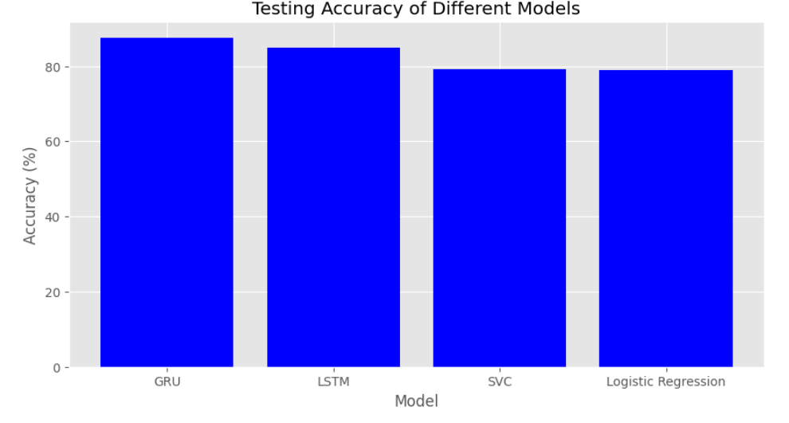

# RNN Text Classification

This is a small study to try text classification using an RNN model. The aim of this notebook is to develop an LSTM model that accurately predicts which Tweets are about real disasters and which ones are not. The workbook compares models based on PyTorch, both LSTM and GRU. Additionally, there are benchmark implementation of logistic regression and SVC for classification. The source data to run this notebook can be found at: https://www.kaggle.com/competitions/nlp-getting-started/data. 

The GRU model outperformed the other models in terms of accuracy, with an accuracy of 87.5%. The LSTM model also performed well, with an accuracy of 84.9%. The benchmark models, SVC and Logistic Regression, had accuracies of 79.1% and 78.9%, respectively. The bar chart above shows the testing accuracy of the different models.

Future work would include fine tuning the GRU model in general and to be able to handle larger batch sizes and thereby increase GPU utilization, which could increase accuracy further.

